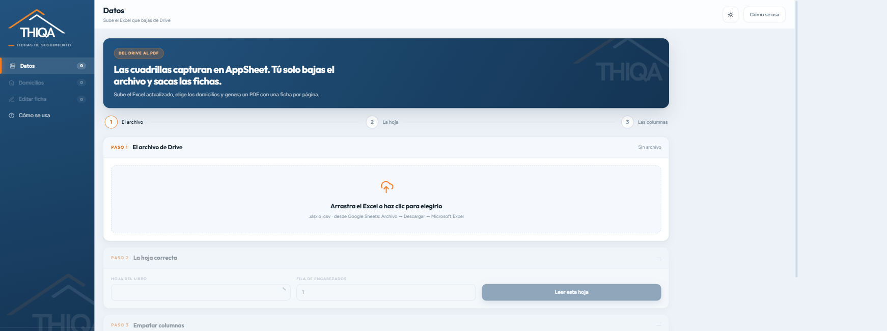

<div align="center">

# 🏠 Generador de Fichas THIQA

**Crea fichas imprimibles (PDF) de casas en recuperación directo desde un Excel — sin instalar nada.**

[](https://eliasgaribi-ctrl-z.github.io/generador-fichas-thiqa/)


</div>

---


<div align="center">

</div>

## ¿Qué hace?

Este proyecto es una sola página web (`index.html`) que lee un archivo Excel con el listado de domicilios y genera, para cada uno, un **documento listo para imprimir o guardar como PDF**. De la misma selección salen dos:

- La **ficha de seguimiento**: hoja completa por domicilio, con dirección, datos de la cartera, folio, dinero y las seis etapas para firmar.
- La **carátula del expediente físico**: la portada de la carpeta que se archiva. Media hoja, dos por hoja carta, y trae nada más lo que se lee de canto en el archivero.

No requiere servidor, cuenta ni instalación — se abre directo en el navegador.

## 🚀 Usar la app

1. Entra a **[eliasgaribi-ctrl-z.github.io/generador-fichas-thiqa](https://eliasgaribi-ctrl-z.github.io/generador-fichas-thiqa/)**
2. Elige qué vas a imprimir: **ficha de seguimiento** o **carátula de expediente**. Se puede
   cambiar cuando quieras, arriba en Datos o en la barra de abajo.
3. Sube tu archivo Excel con el listado de domicilios.
4. La app te dice cuántos domicilios leyó y cuántas columnas empató sola. Si algo no cuadra,
   ábrelo en **Revisar columnas**; si no, sigue de largo.
5. Elige la casa o casas que quieras y genera el PDF.
6. Imprime o guarda como PDF desde el navegador (`Ctrl/Cmd + P`).

## ✨ Características

- **Un solo archivo** (`index.html`) — no depende de librerías externas ni de instalación.
- **Dos documentos del mismo Excel**: la ficha de seguimiento y la carátula del expediente
  físico. Se elige en la barra de abajo y se cambia cuando quieras: los datos, los filtros,
  la selección y lo que hayas editado a mano son los mismos para las dos.
- **Lee Excel directamente** en el navegador, sin subir datos a ningún servidor.
- **Encuentra sola la hoja y la fila de encabezados**: de un libro con varias pestañas
  (respaldos, catálogos, instrucciones) abre la que trae los domicilios, aunque el
  encabezado no esté en la primera fila.
- **Empata las columnas automáticamente** contra los campos de la ficha, y recuerda las
  correcciones que hagas para la próxima vez.
- **Conserva las ligas del Sheet**: los enlaces de Google Maps y las carpetas de Drive que
  cuelgan de una celda quedan como enlaces vivos dentro del PDF. Se leen de las dos formas en
  que el Sheet las exporta: como hipervínculo de Excel y como fórmula `=HYPERLINK("…")`, que
  es la que usa Google cuando la liga se armó con fórmula. En la bitácora maestra eso son
  **214 carpetas de expediente digital y 125 mapas** que antes se perdían enteros.
- **El domicilio sale de la columna Link**: ahí la celda guarda el texto de la dirección ya
  corregida y la liga de Maps cuelga aparte, mientras que la columna de domicilio suele venir
  pegada (`AV TEMUCO286SANTA FE00630TLAJOMULCO`). Se usa el texto de Link cuando lo hay; si
  está vacío —o si trae una URL en vez de una dirección— manda la columna de domicilio.
- **Buscador por palabras sueltas**: escribes los datos que te acuerdes, en cualquier orden
  (`cerro 129`), y busca en folio, domicilio, colonia, municipio, ruta y cuadrilla.
- **Filtro por estatus de ruta**: como los líderes mueven el estatus desde la app de campo,
  cada estatus es una casilla que puedes prender o apagar. Llegan prendidas **Próximas
  Recuperaciones** y **Recuperadas** —las que ya tienen el convenio confirmado, que son las
  que ameritan ficha—; los demás estatus llegan apagados y basta prender su casilla para
  meterlos en la corrida. Ninguna casa se descarta al leer el archivo.
- **Liga de Google Maps en cada ficha**, sin costo y sin salir del navegador: se respeta la
  del Sheet cuando existe y, si no, se arma con el domicilio, colonia, C.P. y municipio.
- **Dos códigos QR en la ficha impresa**, en el riel de la derecha: el primero abre el mapa
  del domicilio y el segundo la carpeta del expediente digital, la misma que lleva la
  carátula. En papel la liga viva no sirve de nada, y la idea es que en la calle se escanee
  con el celular en lugar de teclear la dirección o ir a buscar el folio al Sheet. Llevan
  exactamente la misma URL que los enlaces, se dibujan aquí mismo —sin librerías ni
  servicios de terceros— y van a 92 px porque de ahí para abajo los módulos bajan de 0.4 mm
  en papel y la cámara empieza a batallar. Si una fila no trae carpeta, esa ficha sale nada
  más con el del mapa y el otro se quita entero.
- **Control de obra (opcional)**: el área de obras lleva su propio Excel de tapeados y ahí
  no hay folio, así que las dos tablas se unen por dirección —número de casa más las
  palabras de la calle, ignorando el relleno y la cola que arrastra el domicilio: el C.P.
  que viene en el texto de la liga de Maps y el dato catastral de la cartera
  (`NA MZ 17 LT 39 EDIF NA NIV 03`), que traen números que no son el de la casa—. De ahí salen
  solos los materiales con su unidad (`260 pz`, `13 sacos`), las medidas de tapeo y el
  total. Si una vivienda trae tapeo y retapeo se suman en una sola ficha y la nota lo dice.
  Lo que capturaste a mano siempre gana.
- **Edición por domicilio** antes de generar la ficha final.
- **Exportación a PDF** usando la función de impresión del navegador.

## 📂 Carátula del expediente físico

La carpeta que se archiva necesita portada, y esa portada no es la ficha: no lleva acreditado,
ni crédito, ni juzgado, ni las seis etapas. Lleva lo que se busca hojeando el archivero.

Sale del mismo Excel y de la misma selección — **no pide ninguna columna nueva**. Se elige en
la barra de abajo, junto al botón de generar, y trae:

- **Estatus** en el recuadro del encabezado.
- **Domicilio completo** en un renglón: calle, colonia, C.P., municipio y entidad. Como el
  texto de la columna Link ya suele traer la colonia y el municipio dentro
  (*“Av. Temuco 286, Santa Fe”*), cada parte se agrega nada más si no está dicha, para que no
  salga repetida.
- **Fuente, cuadrilla y ruta.**
- **Monto acordado** —el mismo que la ficha usa arriba—, **fecha de desocupación** (la de
  desalojo acordada) y **fecha de convenio**.
- Las casillas de **contenido del expediente**: convenio, solicitud de pago, convenio Thiqa,
  INE, acta de entrega, honorarios pagados y firma finalizado. Van sin palomear, porque se
  marcan conforme se mete el papel a la carpeta.
- Un **código QR** que abre la carpeta de ese folio en Drive: se escanea con la cámara del
  celular parado frente al archivero, sin buscar el folio en el Sheet.

### El QR

Sale de la liga que ya trae el Sheet, no de un servicio de internet: el código se arma dentro
del navegador, así que funciona sin conexión, no le manda la liga de tu carpeta a nadie y en
el PDF queda dibujado —no es una imagen que se pueda caer—.

Apunta siempre a la carpeta del **expediente digital**, que es la carpeta del folio. En la
bitácora maestra esa columna trae liga en las **214 filas**, así que el QR sale parejo en todas
y siempre lleva al mismo lugar. Abajo del código lo dice, para que nadie escanee esperando otra
cosa. Si una fila no trae liga, esa carátula sale sin QR.

Va lo menos apretado posible, que es lo que se lee bien en papel: nivel de corrección L y sin
el `?usp=drive_link` que Drive le cuelga a sus ligas —15 caracteres que no hacen falta para
abrir la carpeta y que brincarían el código de 33×33 módulos a 37×37—. Así los 214 salen
iguales, de 33×33, a poco más de 2.5 cm por lado.

El código va en el hueco que queda a la derecha de las casillas, sin mover nada de lo demás:
siguen saliendo dos carátulas por hoja carta. Si una fila no trae ninguna liga, el recuadro
del QR se quita y las casillas se estiran.

Cada carátula ocupa **media hoja carta y salen dos por hoja**, con línea punteada de por medio
para cortarlas. Si la selección es impar, la última hoja se va con la mitad de abajo en blanco.
Lo que el archivo no traiga sale como recuadro vacío para llenarlo a mano.

En modo carátula el editor muestra sólo esos campos —de nada sirve corregir el juzgado en un
papel donde el juzgado no sale— y la vista previa cambia a media hoja. Al volver a la ficha
está todo otra vez. El documento elegido se recuerda para la próxima.

El formato tal cual, para abrirlo y llenarlo a mano sin pasar por el Excel, está en
[`plantilla-caratula-expediente.html`](plantilla-caratula-expediente.html).

## 🎙️ Dictar fichas sin Excel

En la pestaña **Dictar** hablas de corrido, incluso de varias casas seguidas —*“Boulevard
República de Honduras 134, Hacienda Santa Fe, Tlajomulco, cuadrilla de Teófilo, monto sesenta
mil, bono quinientos”*— y la IA separa cada domicilio y llena los campos de la ficha. Puedes
corregir el texto antes de crearlas, o escribirlo/pegarlo si tu navegador no dicta.

Las fichas dictadas se juntan con las del Excel: se filtran, se editan y se imprimen igual, y
entran con el estatus `Dictada` para distinguirlas. Quedan guardadas en el navegador aunque
cierres la página. El dictado por voz usa la API del navegador (Chrome o Edge).

## 🤖 IA opcional (tu propia API key)

Se usa para dos cosas: **convertir el dictado en campos de la ficha** y **desenredar las
direcciones que llegan pegadas** del tipo `AV BOGOTA275SANTA FE00630TLAJOMULCO DE ZUNIGA45653STMJL`.
Todo lo demás —incluida la liga de Maps— se resuelve sin IA, gratis y sin llamadas.

Como el proyecto es un archivo estático en GitHub Pages, **no existe un servidor donde
esconder una API key**: cualquier key en el código sería pública. Por eso la pones tú y se
guarda únicamente en el `localStorage` de tu navegador. Nunca hay una key en este repositorio.

Proveedores soportados, priorizando lo gratuito. Cada uno ya trae puesta su URL base y un
modelo que servía al momento de escribir esto, así que sólo hay que pegar la key:

| Proveedor | Costo | Nota |
|---|---|---|
| **Google Gemini** | capa gratuita permanente | key en `aistudio.google.com/apikey`; tope por minuto. El que menos se rompe |
| **Groq** | capa gratuita, sin tarjeta | key en `console.groq.com/keys`; muy rápido |
| **OpenRouter** | modelos gratis, sin tarjeta | key en `openrouter.ai/keys`; ~50 llamadas al día sin comprar créditos |
| **Cerebras** | capa gratuita, sin tarjeta | key en `cloud.cerebras.ai`; el más rápido, pero 8 mil tokens por llamada |
| **Otro compatible con OpenAI** | según proveedor | para DeepSeek, Together o un modelo en tu red; pones URL base y modelo |
| **Anthropic Claude** | de paga, centavos por corrida | llamada directa desde el navegador verificada |

> **Los modelos gratuitos se apagan seguido.** Groq retiró `llama-3.3-70b-versatile` en
> agosto de 2026 y OpenRouter rota su lista cada semana, así que un modelo que servía el mes
> pasado hoy puede contestar *"ese modelo ya no está"* aunque la key esté perfecta. Para eso
> está el botón **Ver modelos**: le pregunta al proveedor cuáles está sirviendo en este
> momento y los pone con un clic. Si algo deja de funcionar, ése es el primer botón que hay
> que picar. Con OpenRouter viene puesto `openrouter/free`, que deja que ellos escojan uno vivo.

El botón **Probar mi key** hace una llamada mínima y dice de una vez si el proveedor la
acepta, sin tener que dictar algo primero. Como el campo se ve de contraseña, el navegador a
veces lo rellena solo con una contraseña guardada: por eso está el **ver** de al lado, y por
eso el encabezado de la tarjeta dice cuántos caracteres tiene la key que va a salir —una de
Google Gemini empieza con `AIza` y mide 39.

Qué sale del navegador, según la tarea:

- **Desenredar direcciones del Excel**: solo dirección, colonia, C.P., municipio y estado.
  Nunca el nombre del acreditado, el crédito, el expediente ni los montos.
- **Dictado**: el texto que dictaste, completo — de ahí salen los datos de la ficha.

Lo que la IA escriba queda marcado como edición tuya y se puede deshacer en bloque.

## 📋 Qué lleva la ficha

Encabezado (cartera, ruta, folio, fecha y estatus), el domicilio con las casillas de
cartera, el dinero de la recuperación (monto, fecha, bono y honorario), el expediente digital
con las fechas clave (asignación, desalojo, convenio) más carta poder y cuenta predial, el
líder de cuadrilla con su foto, el presupuesto de honorarios y bonos, y las seis etapas de
seguimiento con sus firmas —la 3 con el control de obra de tapeados—. Del lado derecho, en
un riel del mismo ancho de arriba abajo, van los dos códigos QR —mapa y expediente— y el
hueco grande de la foto del domicilio. Los campos que tu archivo no traiga salen como línea
en blanco para llenarse a mano.

Las casillas de cartera son cuatro: **BNC, INF, PIC y SOJI**. DAPA salió porque esa cartera
ya no se llama así —es SOJI, Soluciones Jurídicas Infonavit—, y una fila que todavía traiga
el nombre viejo palomea SOJI igual, para que no salga sin cartera marcada.

La hoja imprime menos de lo que lee, a propósito: número de expediente, juzgado, etapa
judicial, folio real, número de crédito y acreedor **se siguen leyendo del Excel y se
siguen pudiendo editar por domicilio**, nada más dejaron de ocupar lugar en el papel cuando
se adoptó el formato oficial nuevo.

### Una sola foto, la del domicilio

La hoja se imprime al firmar el convenio y de ahí se va a firmar a mano: para cuando hay
avance de obra ya trae la firma del líder de cuadrilla y la de solicitud de recurso, así que
reimprimirla nada más para pegarle las fotos de obra obligaba a volver a juntar firmas. Por
eso la etapa 4 ya no lleva los seis huecos de antes y después, ni la 3 el de materiales.
Queda uno solo y más grande, el del domicilio, abajo de los dos QR en el riel de la derecha:
esa foto existe desde que se firma el convenio, o sea antes de imprimir, y por eso sí alcanza
a salir en la hoja.

### El acomodo de la hoja

Lo que dejaron los huecos de foto no se quedó en blanco. Las etapas 4 y 5 quedaron pidiendo
lo mismo —responsable, fecha y firma—, así que van juntas en un renglón como el par que son,
y la 6 se quedó sola a lo ancho, que es el cierre. Las rayas donde se firma crecieron de 17 a
21 px, porque la hoja se llena con pluma. Y las cuatro casillas de cartera se acomodaron en
un cuadro de dos por dos, con lo que el domicilio se quedó con el renglón casi entero y cabe
completo aunque venga con colonia, C.P. y municipio.

El formato suelto, para imprimirlo en blanco y llenarlo a mano sin pasar por el Excel, está
en [`plantilla-ficha.html`](plantilla-ficha.html) y sale de la misma plantilla que usa la
app. Ese va sin los QR: sin domicilio ni carpeta capturados no hay de dónde sacarlos, y un
recuadro de código vacío no se llena con pluma.

### Responsable arriba, firma abajo

En cada etapa el nombre se pedía dos veces: arriba en **Responsable** y otra vez abajo en
**Nombre y Firma**. Abajo quedó nada más **Firma**, que es lo único que se pone de puño y
letra. La etapa 6 —entrega de honorarios— no tiene Responsable, así que ahí se sigue pidiendo
el nombre junto con la firma.

La carátula del expediente físico lleva mucho menos, a propósito: nada más domicilio, fuente,
cuadrilla, ruta, monto, las dos fechas y las casillas del contenido de la carpeta. El detalle
está [más arriba](#-carátula-del-expediente-físico).

## 🛠️ Uso local

Si prefieres correrlo en tu computadora en vez de usar la versión en línea:

```bash
git clone https://github.com/eliasgaribi-ctrl-z/generador-fichas-thiqa.git
cd generador-fichas-thiqa
```

Y abre `index.html` con cualquier navegador.

## 🏗️ Stack

HTML + CSS + JavaScript vanilla — sin frameworks, sin build step.

---

<div align="center">
<sub>Proyecto interno THIQA · Seguimiento de rutas y recuperación de casas</sub>
</div>
